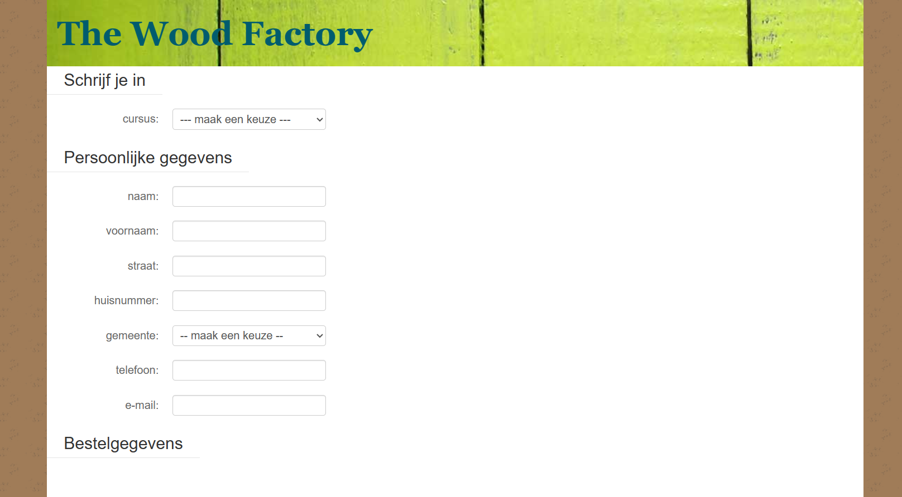

# Cursus Houtbewerking Webpagina

Dit is een webpagina voor een cursus houtbewerking. Gebruikers kunnen zich inschrijven voor verschillende houtbewerkingscursussen en hun persoonlijke gegevens invullen. De pagina maakt gebruik van HTML, CSS en JavaScript.

## Functionaliteiten

- **Cursuskeuze**: Gebruikers kunnen een cursus selecteren uit een lijst met beschikbare cursussen (gegevens in `cursussen.json`).
- **Persoonlijke gegevens**: Gebruikers vullen hun naam, e-mailadres en andere relevante informatie in.
- **Inschrijven**: Na het invullen van de gegevens kunnen gebruikers op een knop drukken om zich in te schrijven voor de gekozen cursus.
- **Foutmeldingen**: Als bepaalde gegevens ontbreken, wordt er een foutmelding weergegeven voor de vergeten velden.

## Gebruik

1. Clone deze repository naar je lokale machine.
2. Open het `woodfactory.html` bestand in je browser.
3. Kies een cursus, vul je persoonlijke gegevens in en druk op de knop om je in te schrijven.

## Voorbeeld



## JSON-gegevens (cursussen.json)

```json
[
    {
        "naam": "houtsoorten herkennen",
        "duurtijd": "4 weken",
        "prijs": 259
    },
    {
        "naam": "planken zagen",
        "duurtijd": "4 dagen",
        "prijs": 138
    },
    {
        "naam": "parketvloer leggen",
        "duurtijd": "2 dagen",
        "prijs": 57
    },
    {
        "naam": "hout beitsen",
        "duurtijd": "4 uren",
        "prijs": 21
    },
    {
        "naam": "houtbewerking",
        "duurtijd": "2 weken",
        "prijs": 204
    }
]
```
